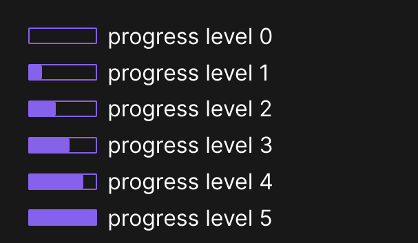

# Geckoworld
Geckoworld is custom theme for [Obsidian](https://obsidian.md/) with a focus on minimal use of color and less distraction elements.


## Screenshots
flexible callout grids


```
> [!multi-callout]
>> [!important] Callout 1
>> text
>
>> [!important] Callout 2
>> text
>
>> [!important] Callout 3
>> text
>
>> [!error] Callout 4
>> text
```

progress checkboxes



```
- [0] progress level 0
- [1] progress level 1
- [2] progress level 2
- [3] progress level 3
- [4] progress level 4
- [5] progress level 5
```


## Features
- minimal color palette
- progress checkboxes
- flexible callout grids

## Installation
1. Download this repo
1. Copy the `theme.css` file into your vault's `/.obsidian/themes` directory
1. Rename the file to `Geckoworld.css` so it will have a unique name in the theme selection dropdown
1. Open the **Settings** in Obsidian
1. Navigate to **Appearances** tab under **Options**
1. Under the **Themes** section, click on the dropdown menu next to **Theme** heading
1. Select `Geckoworld` and then you're done! 🎉
